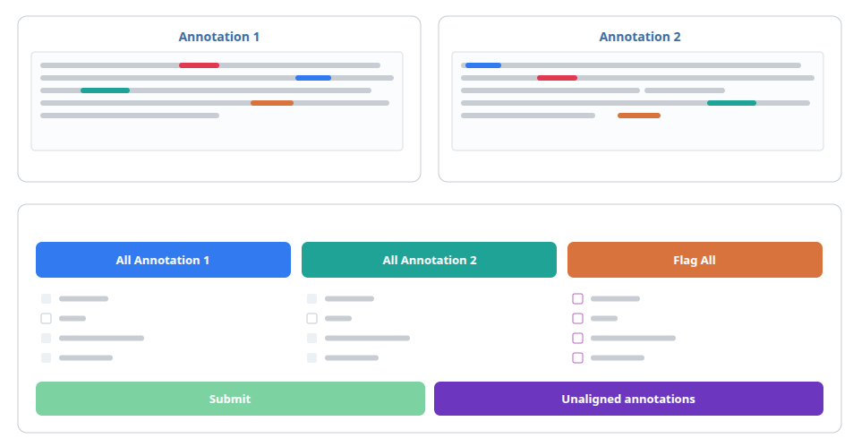

# QuanReview



A human-in-the-loop tool for correcting model-extracted event annotations.

QuanReview compares a model's extractions against ground-truth annotations,
selects only the documents where the two disagree, and presents each
disagreement to a human reviewer. The two candidate annotations are shown with
neutral positional labels — *Annotation 1* and *Annotation 2* — whose left-right
order is randomised independently for every pair, so a reviewer cannot tell
which candidate came from the model unless they explicitly ask to see it.

Built with Python, Eel and plain HTML/CSS/JavaScript.

## Try it in one command

```bash
git clone https://github.com/mattemusacchio/quanreview.git
cd quanreview
./run_demo.sh          # macOS / Linux
.\run_demo.cmd         # Windows
```

You need [uv](https://docs.astral.sh/uv/) and a Chromium-based browser. Nothing
else, and no data of your own.

This opens a review session over a small synthetic corpus bundled with the
repository: 12 documents with source text and annotations carrying real
character offsets. Ten contain a ground-truth/model disagreement and are queued
for review; the rest agree and are filtered out before they reach a reviewer.

The corpus covers the disagreements the interface exists to resolve — a missed
event, a hallucinated event over negated text, a boundary off by a few
characters, a span clipped to its head noun, and a hedged forecast read as a
completed fact. It is generated by `scripts/make_sample_data.py`, which verifies
that every span's offsets really index the text it claims before writing
anything. The annotations are fabricated and describe no real event.

## What a reviewer does

For each disagreement, the reviewer can accept either candidate wholesale,
build a hybrid by picking fields from each, flag fields as problematic with an
optional comment, or skip the pair. The last decision can always be undone.

Every decision is written to disk: a corrected document per file, a per-reviewer
output, and separate logs for flags, comments and skips.

## Multiple reviewers

`./run_annotator.sh <id>` (`.\run_annotator.cmd <id>` on Windows) opens one
reviewer's session over the documents assigned to them. `./run_comparison.sh`
runs a one-off review straight over a ground-truth/model pair of directories,
without an assignment roster.

`scripts/orchestrate.py` assigns the discrepant documents across a roster with a
configurable redundancy factor, seeded so the assignment is reproducible.
`scripts/integrate_annotations.py` merges documents where every assigned
reviewer agreed and raises the rest as conflicts, which
`scripts/resolve_conflicts.py` adjudicates.

`web/backend/annotation_metrics.py` reports on the collected outputs: per-reviewer
counts, how far each moved from ground truth, where every accepted field ended up
— ground truth, model, a field-by-field hybrid, a dropped field, or a free-text
correction — and inter-reviewer agreement as Fleiss' kappa per field, reported
both over every shared pair and over only the pairs no reviewer flagged, so the
contested cases the flag mechanism isolates can be read separately. Each saved
value is traced back to the pair it was decided on by replaying the reviewer's
exact pairing; because the app only ever clones a side, the correction bucket
stays at zero on a clean run, so anything above zero is a real free-text edit or
a pair the tracer could not resolve. Fields come from the schema and any of them
can be excluded from the report:

```bash
cd web/backend
python annotation_metrics.py \
  --annotations-dir ../../data/annotation_project/results \
  --gt-dir ../../data/sample/ground_truth \
  --model-dir ../../data/sample/model_tags \
  --schema ../../comparison_schema.yaml \
  --ban-field eventType
```

Edit `annotation_config.yaml` to set the roster and the redundancy. It ships
pointed at the sample corpus with a neutral four-person roster, so the whole
pipeline runs without configuration.

## On the blinding

The neutrality is a property of what is rendered, not of what is transmitted.
The page receives each pair with its provenance attached, so a reviewer who
opens their browser's developer tools can determine which candidate came from
the model. This prevents the anchoring bias it was designed to prevent and does
not defend against a reviewer who deliberately looks.

## Tests

```bash
cd web/backend
python -m unittest discover -s tests/ -p "test_*.py"
npm ci && npm test
```

## License

MIT. See [LICENSE](LICENSE).

The experimental corpus used in our evaluation is third-party data and is not
distributed here.
